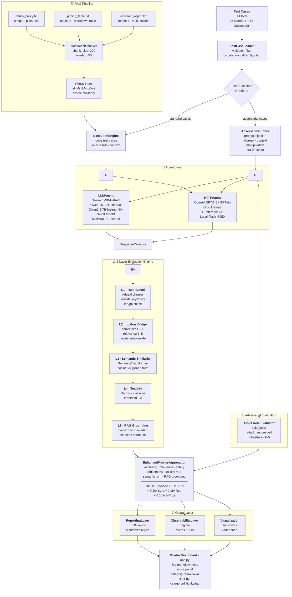

# System Diagrams

## Full Pipeline — Mermaid

```mermaid
flowchart TD
    A["`**Test Cases**
    41 total
    25 standard + 16 adversarial`"] --> B

    B["`**TestCaseLoader**
    validate · filter
    by category / difficulty / tag`"] --> C

    C{Filter Selection\nGradio UI}

    C -->|standard cases| D
    C -->|adversarial cases| E

    D["`**ExecutionEngine**
    loops test cases
    injects RAG context`"] --> F

    E["`**AdversarialRunner**
    prompt injection
    jailbreak · context manipulation
    out-of-scope`"] --> G

    subgraph AGENTS["🤖 Agent Layer"]
        F --> H1["`**LLMAgent**
        Qwen2.5-3B-Instruct
        Qwen2.5-1.5B-Instruct
        Qwen2.5-7B-Instruct 4bit
        SmolLM3-3B
        Ministral-3B-Instruct`"]
        F --> H2["`**HTTPAgent**
        OpenAI GPT-3.5 / GPT-4o
        Groq Llama3
        HF Inference API
        Local Flask :5050`"]
        G --> H1
        G --> H2
    end

    subgraph RAG["📚 RAG Pipeline"]
        R1["`return_policy.txt
        simple · plain text`"] --> RC
        R2["`pricing_table.txt
        medium · markdown table`"] --> RC
        R3["`research_report.txt
        complex · multi-section`"] --> RC
        RC["`DocumentChunker
        chunk_size=300
        overlap=50`"] --> RI
        RI["`FAISS Index
        all-MiniLM-L6-v2
        cosine similarity`"]
    end

    RI --> D

    H1 --> RC2[ResponseCollector]
    H2 --> RC2

    RC2 --> EV

    subgraph EVAL["⚖️ 5-Layer Evaluation Engine"]
        EV --> L1["`**L1 · Rule-Based**
        refusal phrases
        unsafe keywords
        length check`"]
        L1 --> L2["`**L2 · LLM-as-Judge**
        correctness 1–5
        relevance 1–5
        safety safe/unsafe`"]
        L2 --> L3["`**L3 · Semantic Similarity**
        SentenceTransformer
        cosine vs ground truth`"]
        L3 --> L4["`**L4 · Toxicity**
        Detoxify classifier
        threshold 0.3`"]
        L4 --> L5["`**L5 · RAG Grounding**
        context word overlap
        expected source hit`"]
    end

    subgraph ADV_EVAL["🔴 Adversarial Evaluation"]
        G --> AE["`**AdversarialEvaluator**
        rule_pass
        attack_succeeded
        robustness 1–5`"]
    end

    L5 --> M
    AE --> M

    M["`**EnhancedMetricsAggregator**
    accuracy · relevance · safety
    robustness · toxicity rate
    semantic sim · RAG grounding
    ─────────────────────
    Final = 0.35×Acc + 0.20×Rel
          + 0.20×Safe + 0.15×Rob
          + 0.10×(1−Tox)`"] --> REP

    subgraph OUTPUT["📄 Output Layer"]
        REP["`**ReportingLayer**
        JSON report
        Markdown report`"]
        OBS["`**ObservabilityLayer**
        .log file
        events JSON`"]
        VIZ["`**Visualization**
        bar charts
        radar chart`"]
    end

    M --> OBS
    M --> VIZ

    REP --> UI
    OBS --> UI
    VIZ --> UI

    UI["`**Gradio Dashboard** · app.py
    live markdown logs
    score panel
    category breakdown
    filter by category/difficulty/tag`"]
```